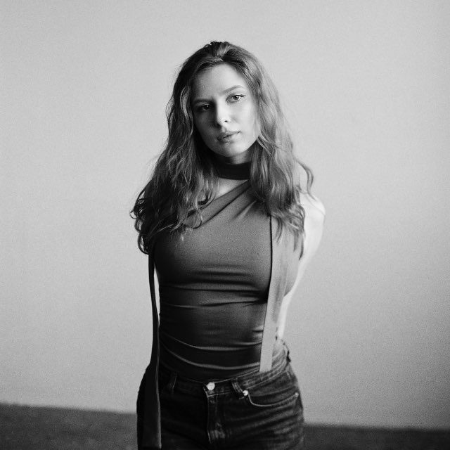

# Всем привет!

{ align=right width=150 }

Меня зовут ***Арина Назарова***. Я фотограф, обучаюсь в магистратуре в ИТМО и развиваюсь в продакт-менеджменте. Добро пожаловать на мой персональный сайт! 

## О сайте

Этот сайт создан в рамках курсовой работы по дисциплине "Введение в веб-технологии".

### Какую информацию можно найти на сайте:

- О моем образовании и навыках
- Мои учебные проекты
- Мои хобби и увлечения 
- Контакты
- Мои достижения

> "Übung macht den Meister" — фраза, которая меня мотивирует, переводится с *немецкого* языка "Усилие создает мастера"

